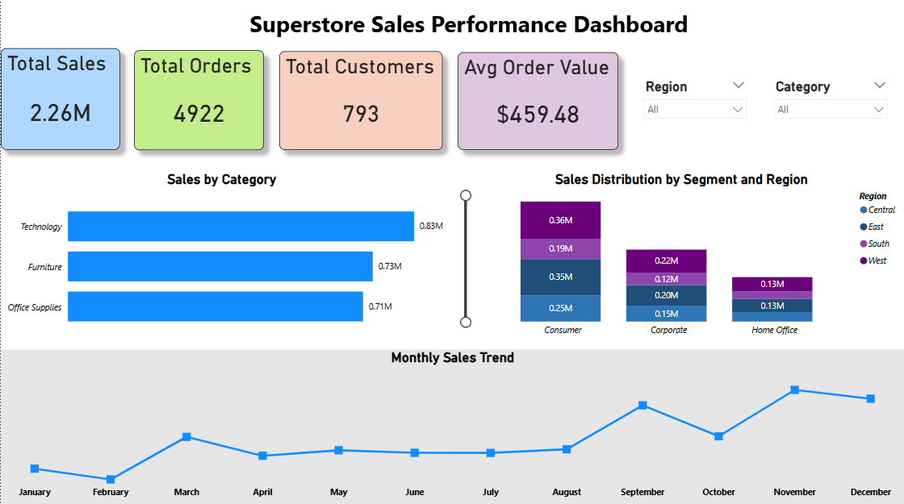

# 📊 Superstore Sales Performance Analysis

## 🔍 Project Overview

This project presents an end-to-end data analysis of retail sales data using Excel, SQL, and Power BI.
The goal is to analyze business performance, identify trends, and derive actionable insights to support decision-making.

---

## 🛠 Tools & Technologies Used

* **Excel** – Data cleaning and exploratory data analysis (EDA)
* **SQL** – Data querying, aggregation, and KPI computation
* **Power BI** – Interactive dashboard and data visualization

---

## 📁 Dataset

* Superstore dataset (`train.csv`)
* Contains information on sales, customers, products, regions, and order dates

---

## 📊 Key Performance Indicators (KPIs)

* **Total Sales**
* **Total Orders**
* **Total Customers**
* **Average Order Value**

---

## 📈 Analysis Workflow

### 🔹 Excel Analysis

* Performed initial data exploration
* Created 5 charts to understand sales distribution and trends

### 🔹 SQL Analysis

* Developed SQL queries to:

  * Compute key performance metrics such as total sales, average order value, and customer-level KPIs
  * Analyze sales performance across categories, regions, and customer segments
  * Identify top-performing products, customers, and geographic locations
  * Generate actionable insights to support data-driven decision-making

### 🔹 Power BI Dashboard

* Built an interactive dashboard featuring:

  * Sales by Category
  * Sales Distribution by Segment and Region
  * Monthly Sales Trend
  * Dynamic filtering using slicers (Region & Category)
  * Key KPI cards

---

## 📸 Dashboard Preview

---

## 🌐 Live Dashboard

*Note: Dashboard link may require Power BI login.*

[View Dashboard](https://app.powerbi.com/links/CLCPNBkqql?ctid=6873b934-6549-4139-99e1-b5e7db3d0016&pbi_source=linkShare)

---

## 💡 Key Insights

* The **Technology category** generates the highest revenue (~827K), outperforming Furniture and Office Supplies, indicating strong demand for tech-related products.

* The **West region** contributes the most to total sales (~710K), followed by the East, while the South region shows the lowest performance, highlighting regional disparities in sales distribution.

* The **Consumer segment dominates sales (~1.14M)**, significantly outperforming Corporate and Home Office segments, suggesting that individual customers are the primary revenue drivers.

* Within the Technology category, **Phones are the top-performing sub-category (~327K)**, contributing the highest revenue and driving overall category performance.

* Sales exhibit a **consistent upward trend from 2015 to 2018**, with noticeable peaks during the final months (especially November and December), indicating strong seasonal demand during the year-end period.

* A small group of customers, such as **Sean Miller and Tamara Chand**, contribute significantly to total revenue, indicating the presence of high-value customers and the importance of customer retention strategies.

---

## 🚀 Project Outcome

* Developed a complete data analysis pipeline from raw data to visualization
* Identified key trends and performance indicators
* Built an interactive dashboard for business decision-making

---

## 📌 Future Improvements

* Add profit-based analysis
* Include customer segmentation insights
* Deploy dashboard online using Power BI Service
